# Assignment 3 - Responsive Web Design

**Name:** Moldir Jarmukhambetova 
**Group:** SE-2540

A single-page project covering all five tasks - responsive typography, media-query layouts, Bootstrap grid, a collapsible navbar, and a portfolio page. Styled with a purple and black theme.

## Part 1 - Media Queries

### Task 0 - Responsive Typography

I made a heading and a paragraph whose font-size changes at three breakpoints: mobile, tablet, desktop.

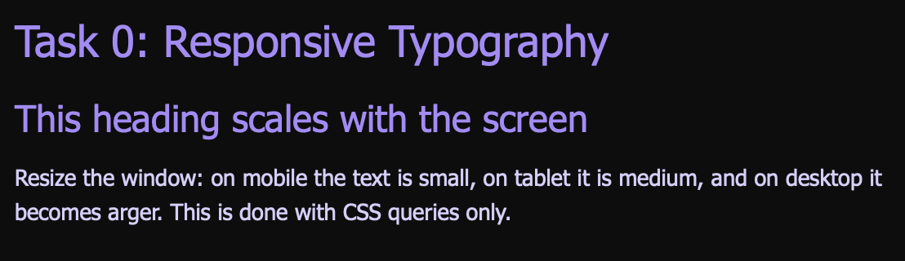
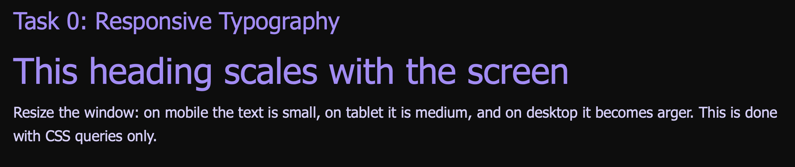

### Task 1 - Responsive Layout with Media @ueries

Three boxes. On mobile they stack vertically, on tablet two fit in a row, on desktop all three fit. 

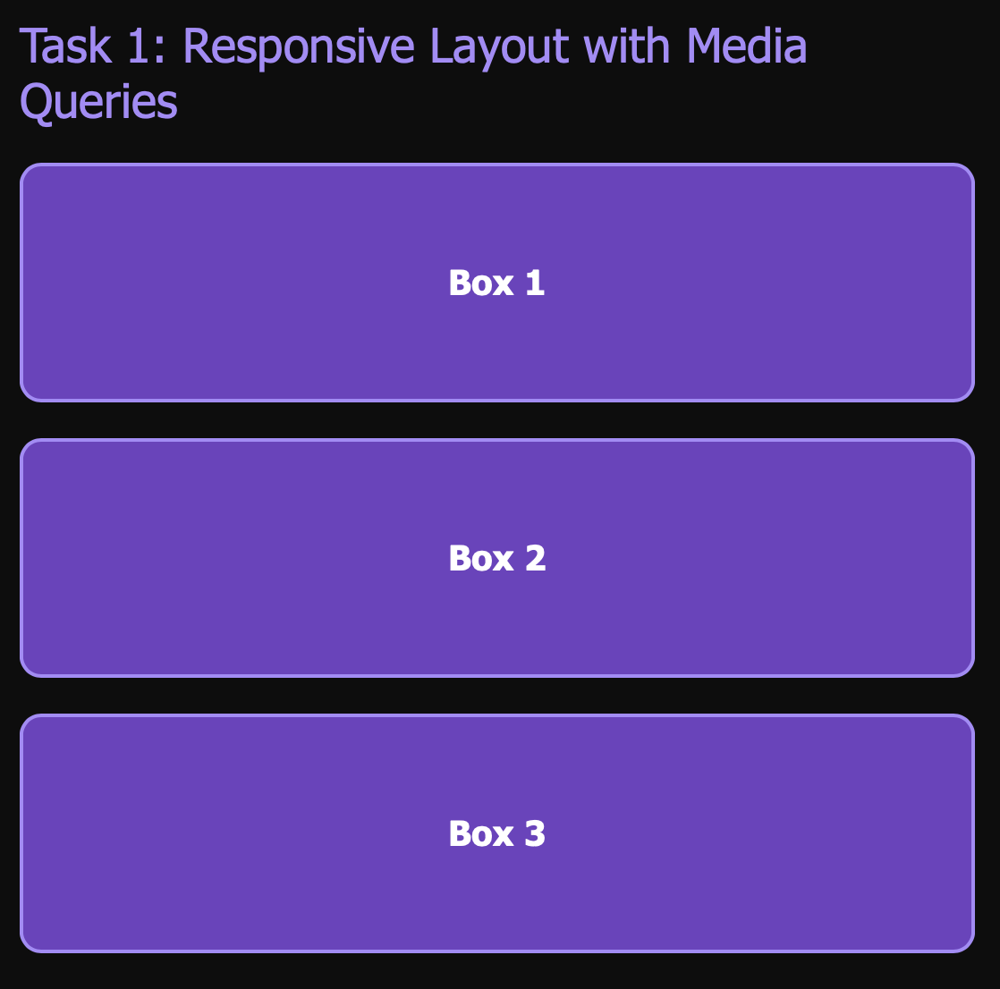
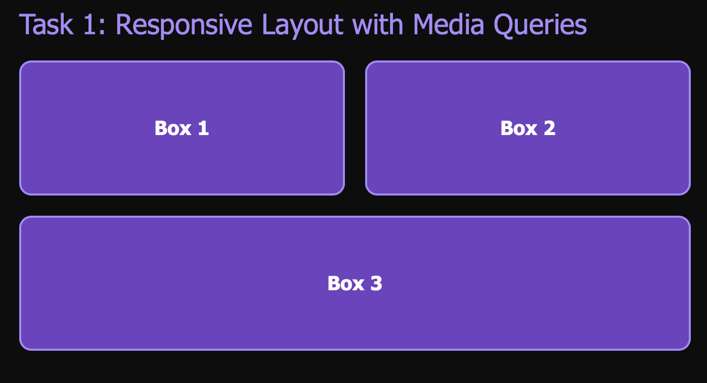
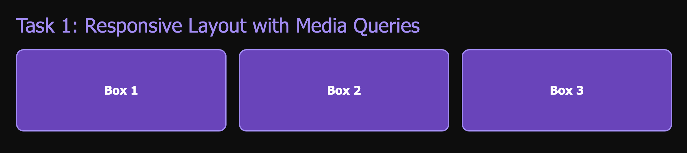

## Part 2 - Bootstrap Grid System

### Task 2 - Bootstrap Responsive Columns

Used Bootstrap's '12-col-12 col-md-6 col-l-4'. The third column uses 'col-md-12' so on tablet it takes the whole second row instead of half of it.

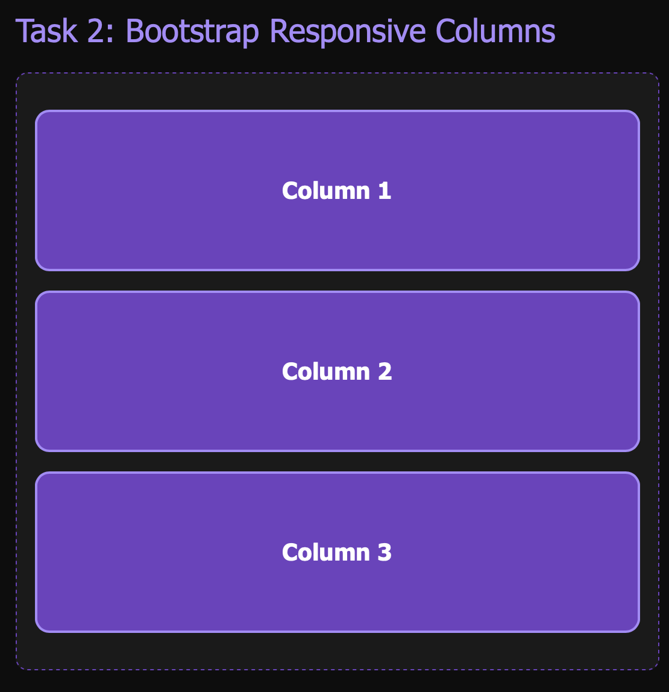
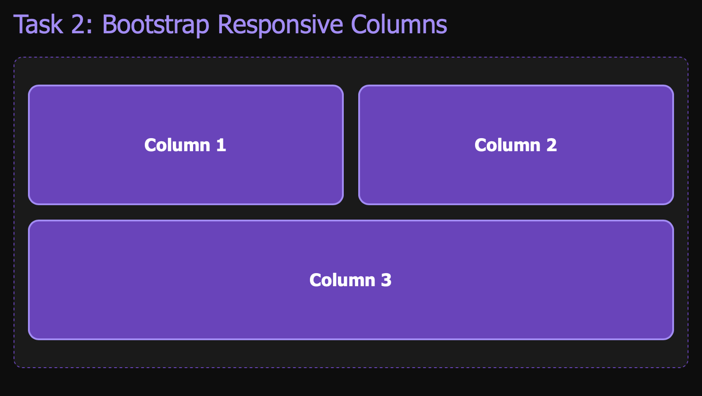
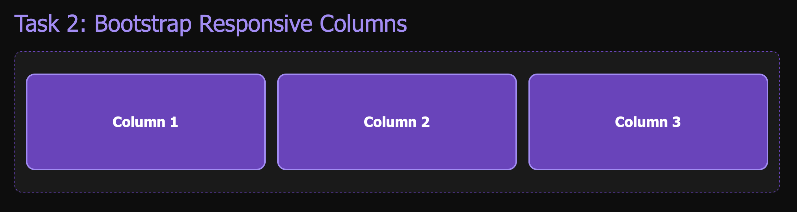

### Task 3 - Bootstrap Navigation Bar

A navbar with the logo on the left and links on the right. On smaller screens the links collapse into a hamburger menu.

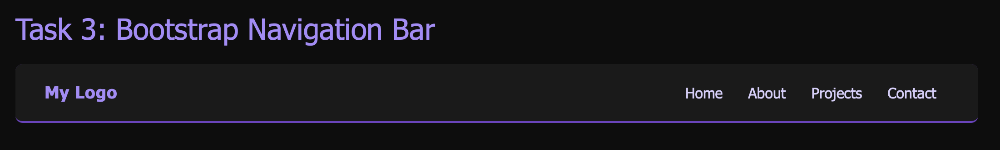
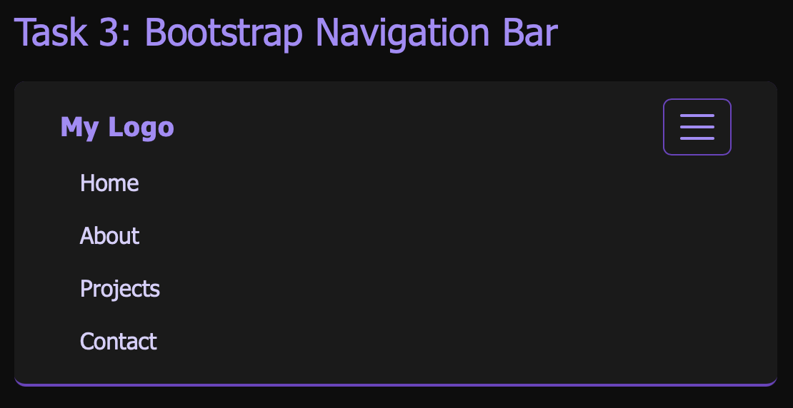

## Part 3 - Combined Project

### Task 4 - Responsive Portfolio Page

A portfolio page that combines everything: navbar at the top; projects on the left; sidebar on the right with "About Me" and "Contact"; footer at the bottom. On mobile the sidebar drops below the project because it uses 'col-12 col-lg-4'. 

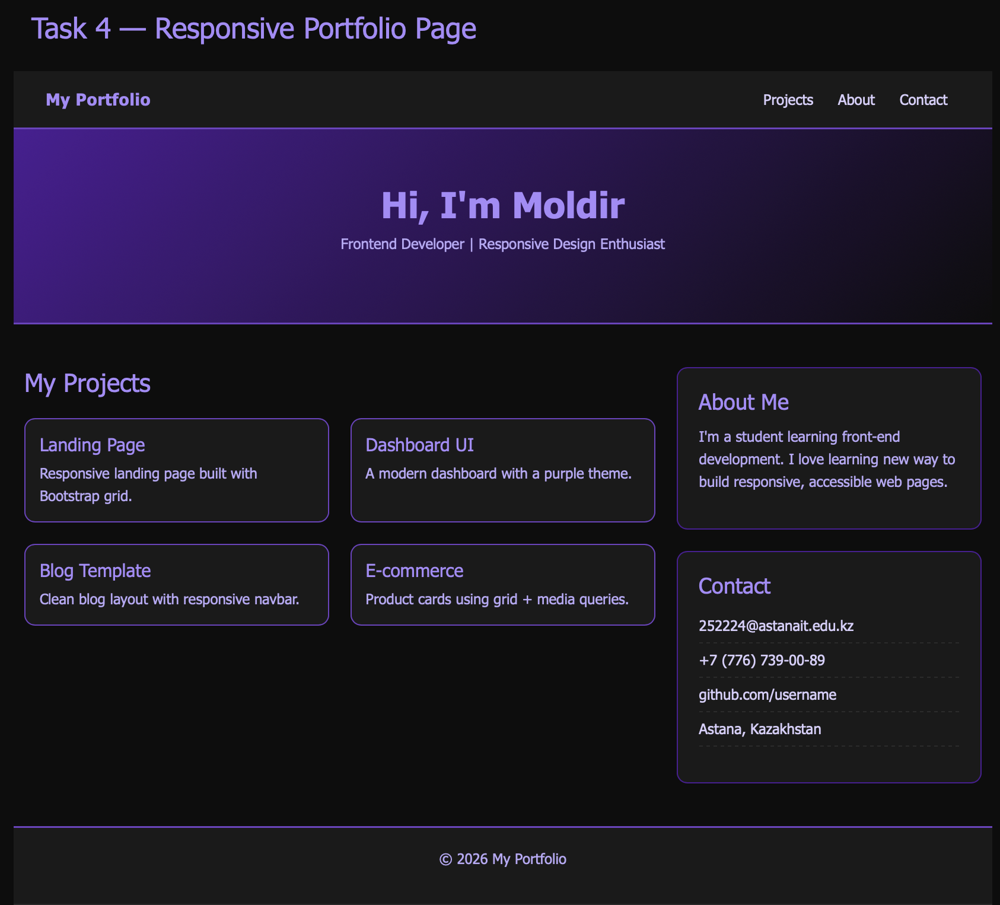
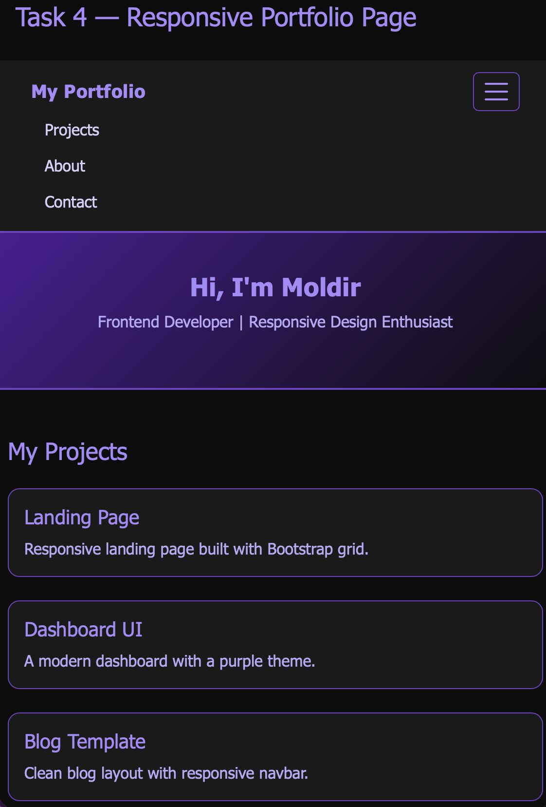
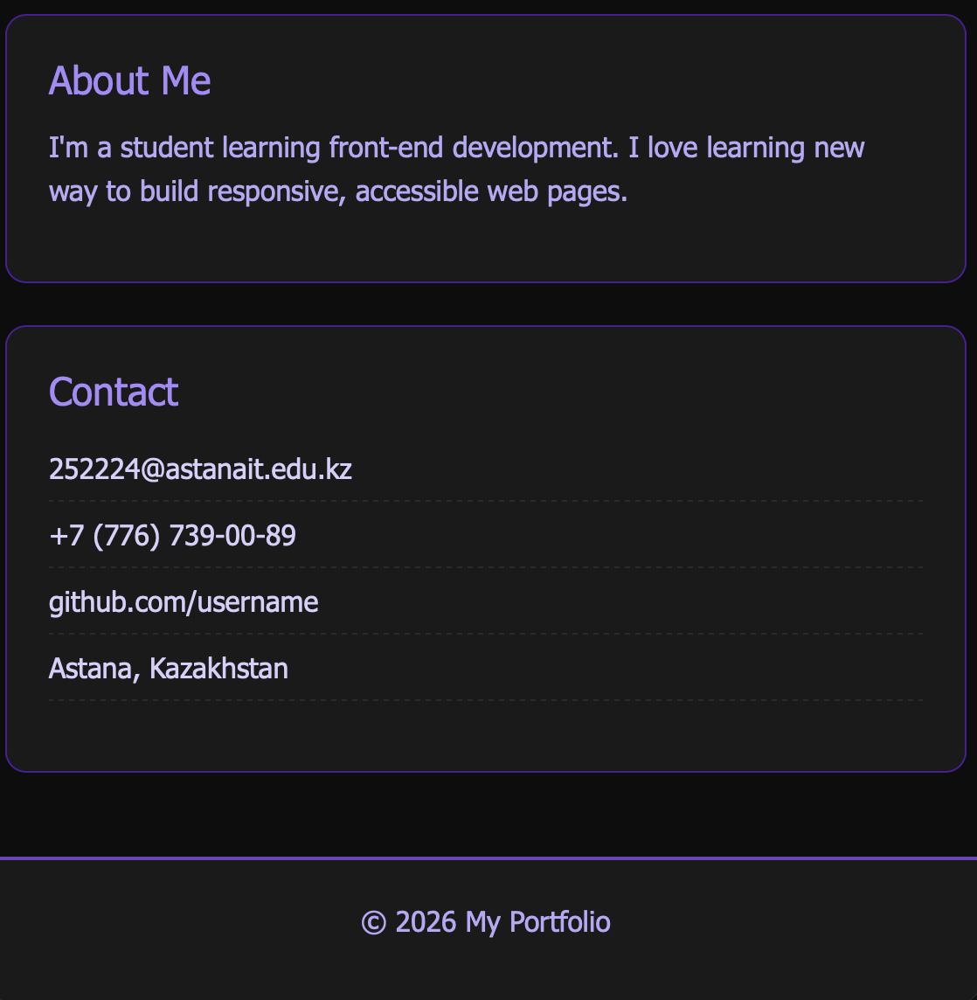

## Summary
I built one HTML page that shows all five tasks, styled with a purple and black theme. Tasks 0 and 1 was only CSS media queries. Tasks 2, 3 and 4 use Bootstrap's grid, navbar, and card components loaded from the CDN. 